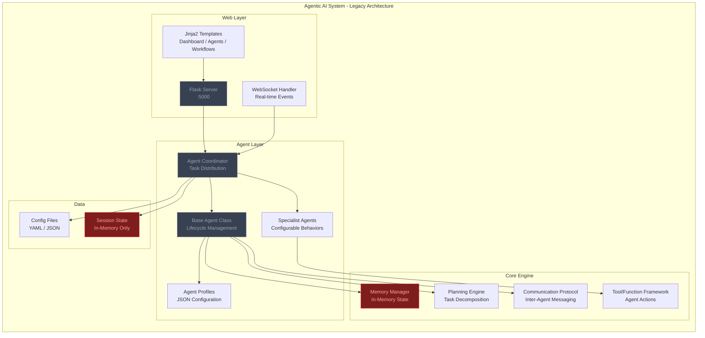
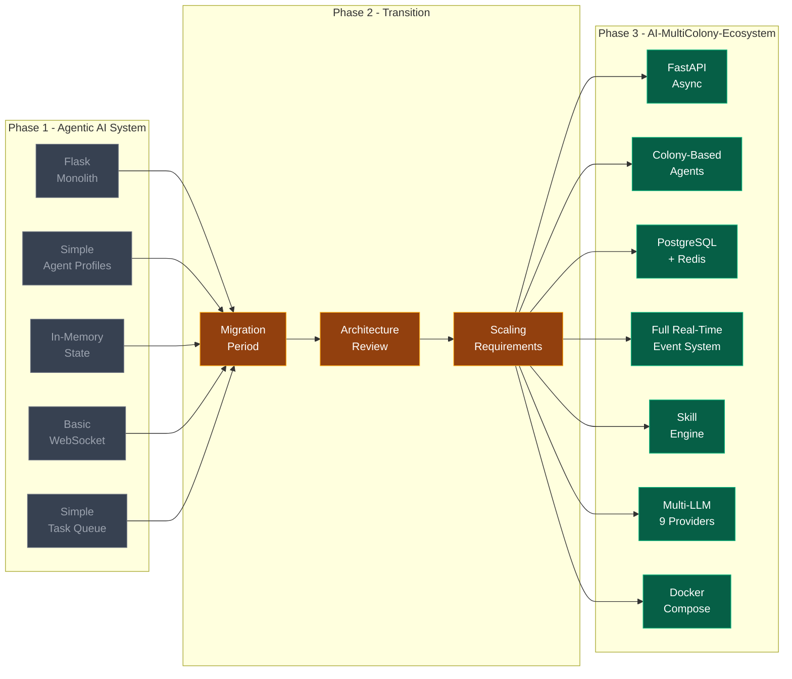

<!-- CAPSULE-RENDER HEADER -->


<!-- ARCHIVED WARNING BANNER -->
<div align="center">

> ### ⚠️ THIS PROJECT IS ARCHIVED ⚠️
> **This repository is no longer maintained.** It is preserved for historical reference only.
> For the actively developed successor, see **[AI-MultiColony-Ecosystem](https://github.com/mulkymalikuldhrs/AI-MultiColony-Ecosystem)**.

<br/>


</div>

<!-- TYPING SVG -->
<div align="center">
  <a href="https://git.io/typing-svg">
    
  </a>
</div>

<br/>

<!-- BADGES -->
<div align="center">

[](https://python.org/)
[](https://flask.palletsprojects.com/)
[](#)
[](./LICENSE)

</div>

---

> **This project is ARCHIVED.** It is no longer maintained and is preserved for historical reference only. For the current, actively developed version, see [AI-MultiColony-Ecosystem](https://github.com/mulkymalikuldhrs/AI-MultiColony-Ecosystem).

---

## Overview

**Agentic AI System** is a **legacy, archived** multi-agent AI system built with Python and Flask. This was an earlier iteration of a multi-agent architecture that has since been superseded by the [AI-MultiColony-Ecosystem](https://github.com/mulkymalikuldhrs/AI-MultiColony-Ecosystem) project.

This repository is preserved for reference, historical context, and educational purposes. It is **no longer actively maintained**.

---

## Visual Architecture

### 1. Legacy Architecture - Original Simple Multi-Agent Flow



### 2. Migration Path - How This Evolved into AI-MultiColony-Ecosystem



### 3. Comparison - Old vs New Architecture Side by Side

```mermaid
graph TB
    subgraph OLD_SYS["Agentic AI System - OLD"]
        direction TB
        OldFlask["Flask Server<br/>Synchronous"]
        OldAgents["Flat Agent List<br/>No Colony Concept"]
        OldMemory["In-Memory Only<br/>Lost on Restart"]
        OldWS["Basic WebSocket<br/>No Event System"]
        OldLLM["Single LLM<br/>No Fallback"]
        OldDeploy["Manual Deploy<br/>No Containerization"]
        OldScale["Single Process<br/>No Scaling"]
        OldState["Session-Based<br/>No Persistence"]
    end

    subgraph NEW_SYS["AI-MultiColony-Ecosystem - NEW"]
        direction TB
        NewFast["FastAPI + Next.js 16<br/>Async + Modern UI"]
        NewColony["Colony-Based Agents<br/>Specialized Roles"]
        NewPersist["PostgreSQL + Redis<br/>Persistent State"]
        NewEvents["Full Event System<br/>Real-time Updates"]
        NewLLM["9-Provider LLM Router<br/>Priority Fallback"]
        NewDocker["Docker Compose<br/>Nginx + Monitoring"]
        NewScale["Multi-Container<br/>Horizontally Scalable"]
        NewAudit["Full Audit Trail<br/>Decision Provenance"]
    end

    OldFlask -.->|"Replaced by"| NewFast
    OldAgents -.->|"Evolved into"| NewColony
    OldMemory -.->|"Upgraded to"| NewPersist
    OldWS -.->|"Replaced by"| NewEvents
    OldLLM -.->|"Expanded to"| NewLLM
    OldDeploy -.->|"Upgraded to"| NewDocker
    OldScale -.->|"Solved by"| NewScale
    OldState -.->|"Replaced by"| NewAudit

    style OldFlask fill:#374151,stroke:#6b7280,color:#9ca3af
    style OldAgents fill:#374151,stroke:#6b7280,color:#9ca3af
    style OldMemory fill:#7f1d1d,stroke:#dc2626,color:#fca5a5
    style OldWS fill:#374151,stroke:#6b7280,color:#9ca3af
    style OldLLM fill:#374151,stroke:#6b7280,color:#9ca3af
    style OldDeploy fill:#374151,stroke:#6b7280,color:#9ca3af
    style OldScale fill:#7f1d1d,stroke:#dc2626,color:#fca5a5
    style OldState fill:#7f1d1d,stroke:#dc2626,color:#fca5a5

    style NewFast fill:#065f46,stroke:#10b981,color:#fff
    style NewColony fill:#065f46,stroke:#10b981,color:#fff
    style NewPersist fill:#065f46,stroke:#10b981,color:#fff
    style NewEvents fill:#065f46,stroke:#10b981,color:#fff
    style NewLLM fill:#065f46,stroke:#10b981,color:#fff
    style NewDocker fill:#065f46,stroke:#10b981,color:#fff
    style NewScale fill:#065f46,stroke:#10b981,color:#fff
    style NewAudit fill:#065f46,stroke:#10b981,color:#fff
```



---

## Features (Historical)

### Multi-Agent Architecture
- Multiple specialized agents with distinct roles and capabilities
- Agent communication protocol for inter-agent messaging
- Task distribution and coordination engine
- Basic agent lifecycle management (spawn, execute, terminate)

### Flask API Server
- RESTful API for agent interaction and control
- WebSocket support for real-time agent communication
- Authentication and session management
- Admin dashboard for monitoring agent activity

### Agent Capabilities
- Configurable agent behaviors via JSON profiles
- Tool/function calling framework for agent actions
- Memory and context management per agent
- Basic planning and task decomposition

---

## Honest Notes

> **Before you explore this codebase:**

- **Archived/Legacy** — This project is archived and no longer maintained. It may contain outdated dependencies, known bugs, and architectural decisions that have been improved upon in later projects.
- **See AI-MultiColony-Ecosystem Instead** — The concepts and architecture from this project have been evolved and significantly improved in the [AI-MultiColony-Ecosystem](https://github.com/mulkymalikuldhrs/AI-MultiColony-Ecosystem). For active development, use that project instead.
- **Not Production Ready** — Even in its active period, this was a research prototype. Do not use this for production systems.
- **Dependencies May Be Outdated** — Python packages and Flask extensions referenced may have newer versions with breaking changes. Pin versions if you need to run this.
- **No Security Audits** — This code was never audited for security. Do not expose the Flask server to the internet.

---

## Quick Start (For Reference Only)

### Prerequisites
- Python 3.11+
- pip

### Installation

```bash
git clone https://github.com/mulkymalikuldhrs/Agentic-AI-System_OLD.git
cd Agentic-AI-System_OLD
pip install -r requirements.txt  # May require version pinning
```

### Running

```bash
python app.py
```

The Flask server will start at `http://localhost:5000`.

---

## Project Structure

```
Agentic-AI-System_OLD/
├── app.py               # Flask application entry point
├── agents/
│   ├── base.py          # Base agent class
│   ├── coordinator.py   # Agent coordination logic
│   ├── specialist/      # Specialized agent implementations
│   └── profiles/        # Agent configuration profiles
├── api/
│   ├── routes/          # API endpoint definitions
│   └── websocket.py     # WebSocket handler
├── core/
│   ├── memory/          # Agent memory management
│   ├── planning/        # Task planning engine
│   └── communication/   # Inter-agent messaging
├── config/              # Configuration files
└── tests/               # Test suites (may be incomplete)
```

---

## Migration Guide

If you're looking to build on the concepts from this project, here's how the architecture evolved:

| Agentic AI System (OLD) | AI-MultiColony-Ecosystem |
|--------------------------|--------------------------|
| Single Flask server | Modular microservices (FastAPI + Next.js) |
| Basic agent profiles | Colony-based agent ecosystems |
| Simple task queue | Advanced orchestration engine |
| In-memory agent state | Persistent state (PostgreSQL + Redis) |
| Basic WebSocket | Full real-time event system |
| Single LLM provider | 9-provider LLM router with fallback |
| No containerization | Docker Compose + Nginx |
| No monitoring | Prometheus + Grafana |
| Session-based auth | Proper auth + audit trails |

---

## Contributing

This project is **archived and not accepting contributions**. Please direct all efforts to the [AI-MultiColony-Ecosystem](https://github.com/mulkymalikuldhrs/AI-MultiColony-Ecosystem) instead.

---

## Disclaimer

This is archived legacy code preserved for reference. It is not maintained, may contain security vulnerabilities, and should not be used in production. For the current version of this concept, see [AI-MultiColony-Ecosystem](https://github.com/mulkymalikuldhrs/AI-MultiColony-Ecosystem).

---

## License

**MIT License** — see [LICENSE](./LICENSE) for details.

---

## Author

<div align="center">

**Mulky Malikul Dhaher**

[](https://github.com/mulkymalikuldhrs)
[](mailto:mulkymalikudhr@mail.com)

</div>

---

<!-- FOOTER BANNER -->

